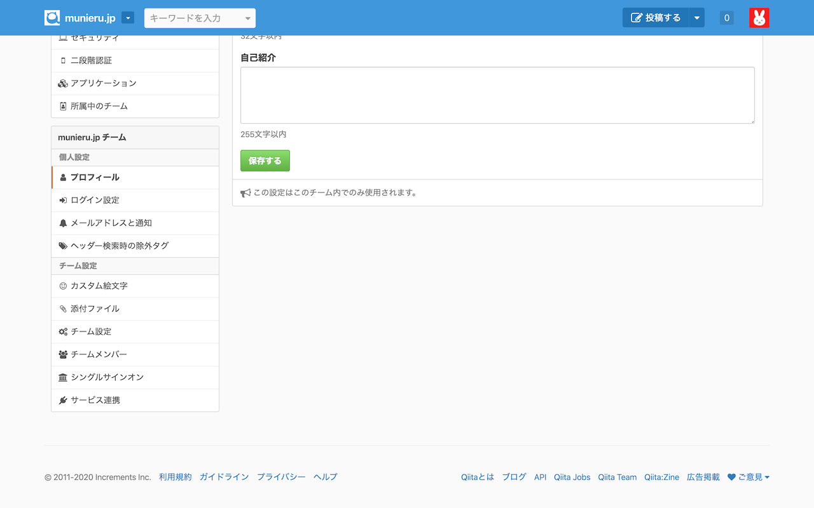
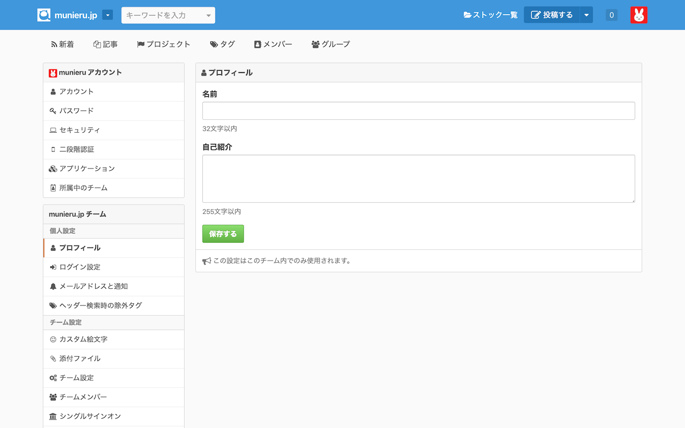
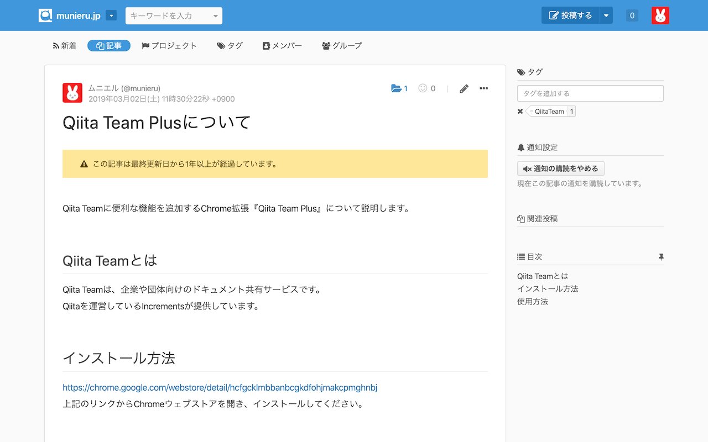
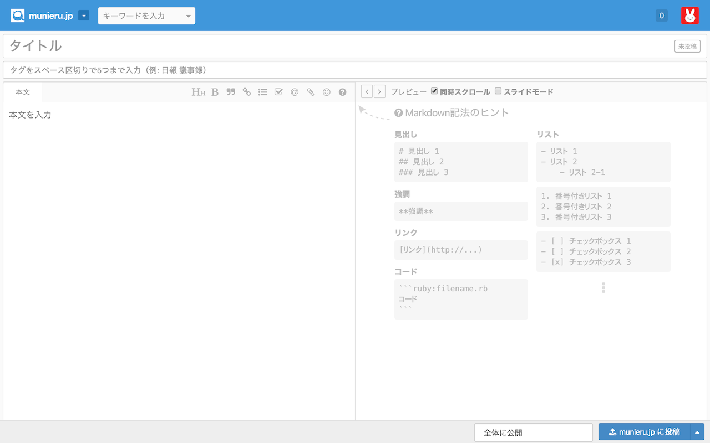

# Qiita Team Plus

Qiita Teamに便利な機能を追加するChrome拡張

## インストール方法

上記のバナーからChromeウェブストアを開き、インストールしてください。

## 機能
以下の機能があります。

### すべての画面
#### ヘッダーを固定

#### ヘッダーにストックボタンを追加

### 記事画面
#### 古い記事にアラートを表示

### 記事編集画面
#### 同時スクロールを自動的に有効化

## How to contribute
[CONTRIBUTING.md](.github/CONTRIBUTING.md)を参照してください。
